# FocusFlow

A responsive Flutter productivity app developed as part of the **Inovegen Internship Program 2026**.

FocusFlow is designed as a productivity-focused mobile application that allows users to manage tasks, start focus sessions, and track their productivity through a clean and responsive interface.

---

# 📌 Task 1 — Static UI Screens

## Overview

**Task 1: Flutter Mobile App Development — Static UI Screens**

The first stage of FocusFlow focused on designing and implementing a small Flutter application with multiple static UI screens.

The main goal was to demonstrate:

* Flutter UI development
* Widget composition
* Layout and spacing
* Typography and styling
* Responsive design
* Reusable components
* Consistent visual design

No authentication, API, database, or backend functionality was required for Task 1.

---

## Concept

FocusFlow is a productivity-focused mobile UI designed to help users manage tasks, start focus sessions, and track productivity.

The application uses a dark-themed interface with purple accents to create a modern productivity-focused visual experience.

---

## Task 1 Screens

The initial version of FocusFlow included the following main screens:

* Home
* Focus Session
* Statistics

---

## 🖼️ Task 1 Screenshots

| Home Screen                                          | Focus Session                                         | Statistics Screen                                      | Statistics Extra                                       |
| ---------------------------------------------------- | ----------------------------------------------------- | ------------------------------------------------------ | ------------------------------------------------------ |
| 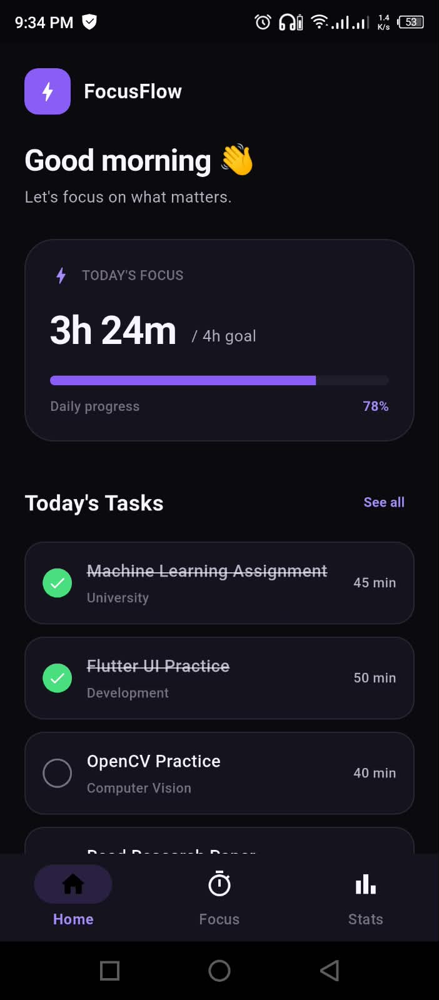 | 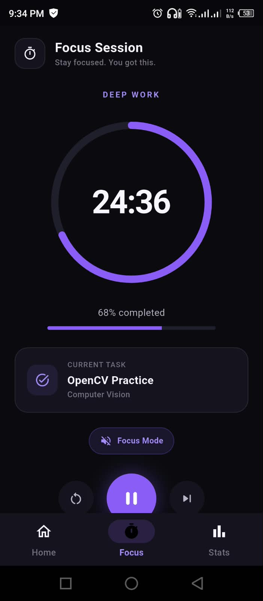 | 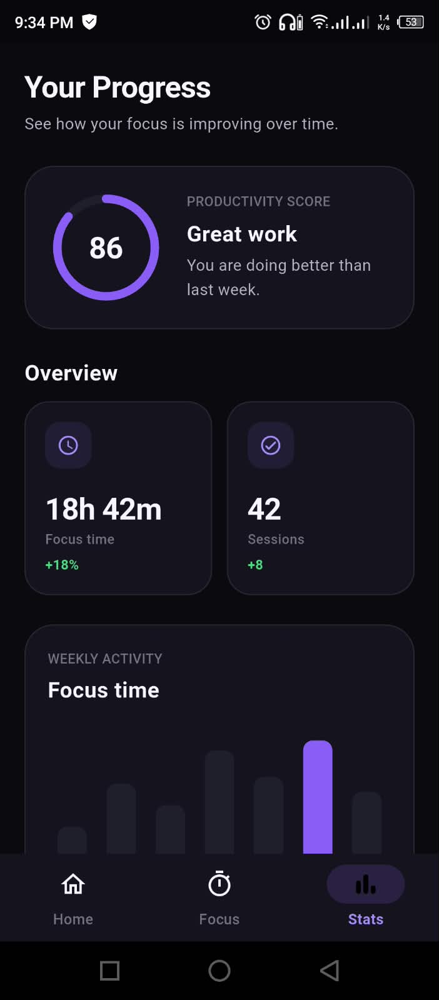 | 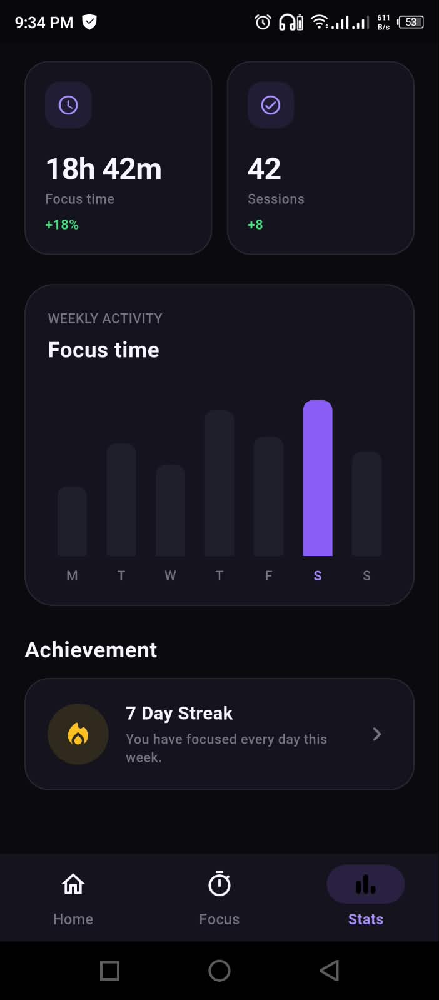 |

---

## Task 1 Technologies

* Flutter
* Dart
* Material Design
* Google Fonts

---

## Task 1 Features

* Responsive UI
* Reusable components
* Productivity dashboard
* Focus session interface
* Statistics visualization
* Consistent dark theme
* Modern typography
* Responsive layouts

---

# 📌 Task 2 — Multi-Screen App, Navigation & Forms

## Overview

**Task 2: Flutter Mobile App Development — Multi-Screen App, Navigation & Forms**

Task 2 extends the FocusFlow application by transforming the static UI into a more interactive multi-screen Flutter application.

The main focus of Task 2 was to implement:

* Multiple connected screens
* Screen-to-screen navigation
* Form handling
* Form validation
* Task creation
* Local task persistence
* Reusable widgets
* Responsive layouts
* Consistent application styling

The application does not use authentication, external APIs, or a backend service.

---

## Task 2 Screens

The completed FocusFlow application contains the following main screens:

### 1. Home Screen

The Home screen acts as the main productivity dashboard.

It provides:

* Productivity overview
* Today's focus progress
* Task list
* Quick-start focus options
* Navigation to other application features
* Task completion functionality
* Task deletion functionality

Users can also navigate from the Home screen to:

* Add Task
* Focus Session
* Statistics

---

### 2. Add Task Screen

The Add Task screen allows users to create a new productivity task.

The form contains:

* Task Title
* Description
* Category
* Focus Duration

Available categories include:

* Study
* Work
* Personal
* Health
* Other

The screen uses Flutter's `Form` and `GlobalKey<FormState>` for form validation.

---

### 3. Focus Session Screen

The Focus Session screen provides a dedicated interface for starting and managing a focus session.

It is designed around the idea of helping users concentrate on a selected task for a defined amount of time.

---

### 4. Statistics Screen

The Statistics screen provides an overview of the user's productivity data.

The screen dynamically displays information such as:

* Total tasks
* Completed tasks
* Focus time
* Completion percentage
* Productivity score
* Session trends
* Productivity insights

---

# 🧭 Application Flow

The application follows a simple navigation structure:

```text
                    ┌──────────────┐
                    │     Home     │
                    └──────┬───────┘
                           │
          ┌────────────────┼────────────────┐
          │                │                │
          ▼                ▼                ▼
    ┌───────────┐   ┌──────────────┐   ┌────────────┐
    │ Add Task  │   │ Focus Session│   │ Statistics │
    └─────┬─────┘   └──────────────┘   └────────────┘
          │
          ▼
    ┌──────────────┐
    │     Home     │
    │ Updated Task │
    └──────────────┘
```

The user can create a task from **Add Task**, return to **Home**, start a focus session, and view productivity statistics.

---

# 📝 Form & Validation

Task 2 introduces a multi-field task creation form.

### Task Title

Validation rules:

* Required
* Minimum 3 characters

### Description

Validation rules:

* Required
* Minimum 5 characters

### Category

The user must select a category from the available options.

### Focus Duration

Validation rules:

* Required
* Must be a valid number
* Minimum: 1 minute
* Maximum: 180 minutes

The form displays appropriate validation messages when invalid information is entered.

---

# 💾 Local Data Persistence

FocusFlow uses **Hive** for local task storage.

Tasks can be:

* Created
* Saved
* Updated
* Marked as completed
* Deleted
* Restored using the Undo action

This allows tasks to remain available locally even after navigating between screens.

No external database or backend is used.

---

# 🖼️ Task 2 Screenshots

## 🏠 Home Screen

| Home                                                        |
| ----------------------------------------------------------- |
| 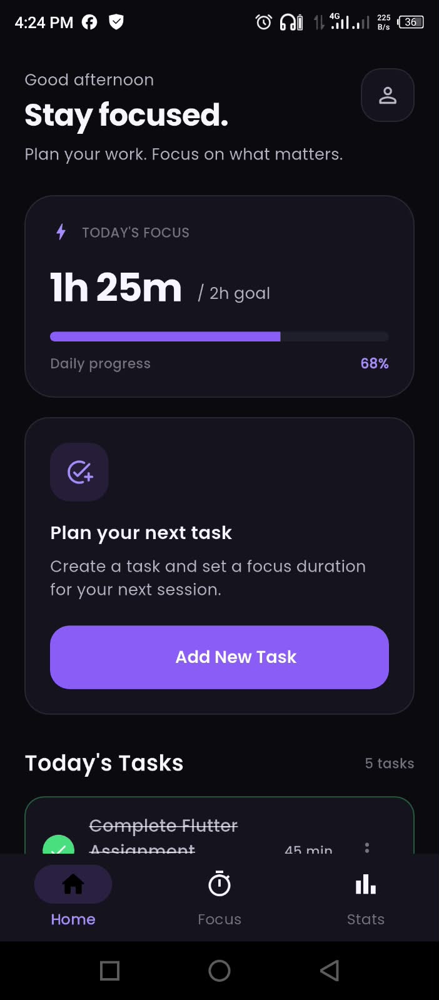 |

---

## ➕ Add Task

| Add Task — Overview                                                |                                                    |
| ----------------------------------------------------------------- | ----------------------------------------------------------------- |
| 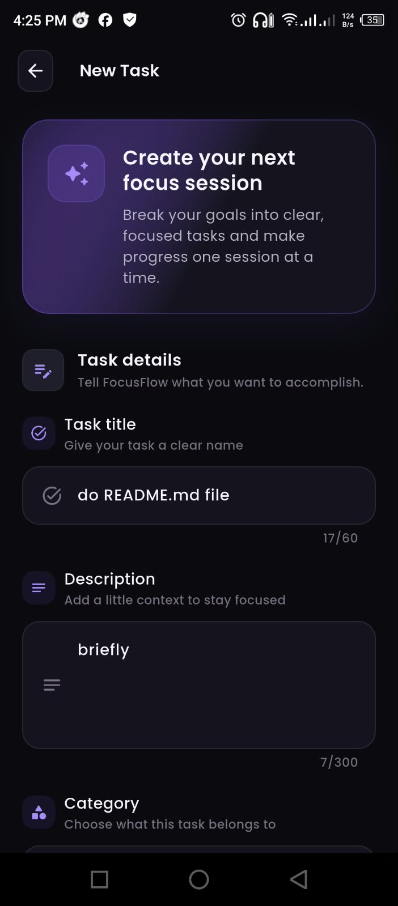 | 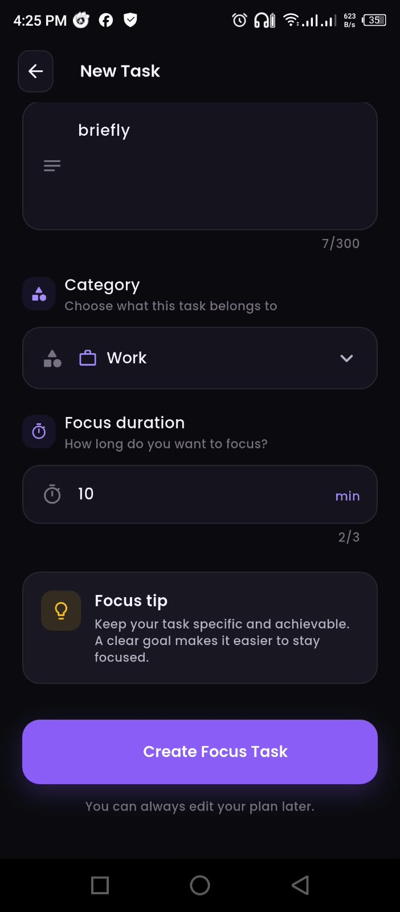 |

---

## ⚠️ Form Validation

| Form Validation                                                        |
| ---------------------------------------------------------------------- |
| 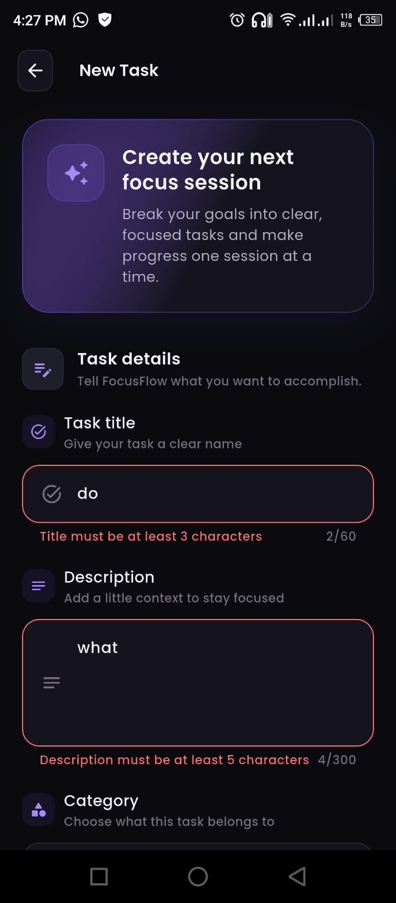 |

---

## 🎯 Focus Session

| Focus Session                                                |
| ------------------------------------------------------------ |
| 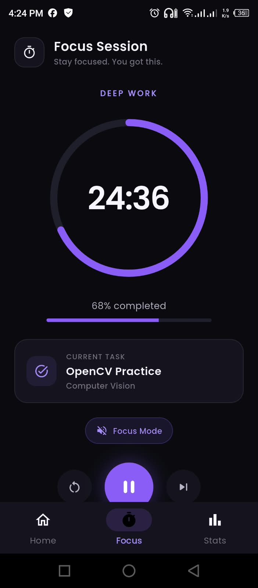 |

---

## 📊 Statistics

| Statistics — Overview                                         |                                           |
| ------------------------------------------------------------- | ------------------------------------------------------------- |
| 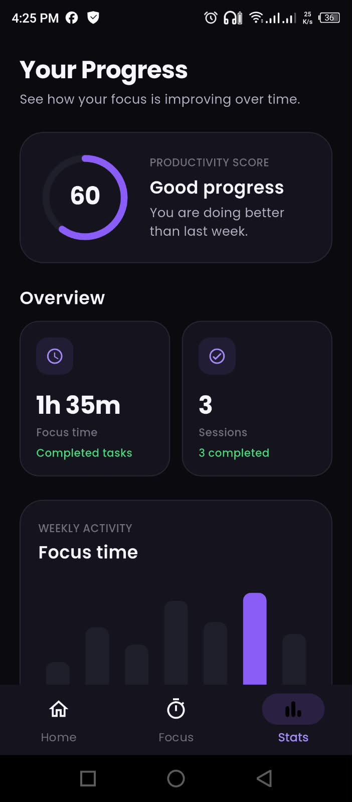 | 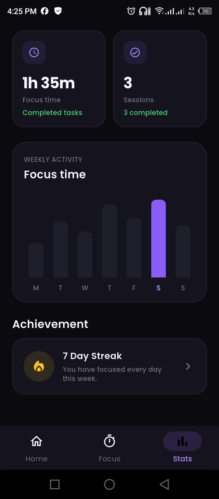 |

---

## ✅ Completed Task

| Completed Task                                                        |
| --------------------------------------------------------------------- |
| 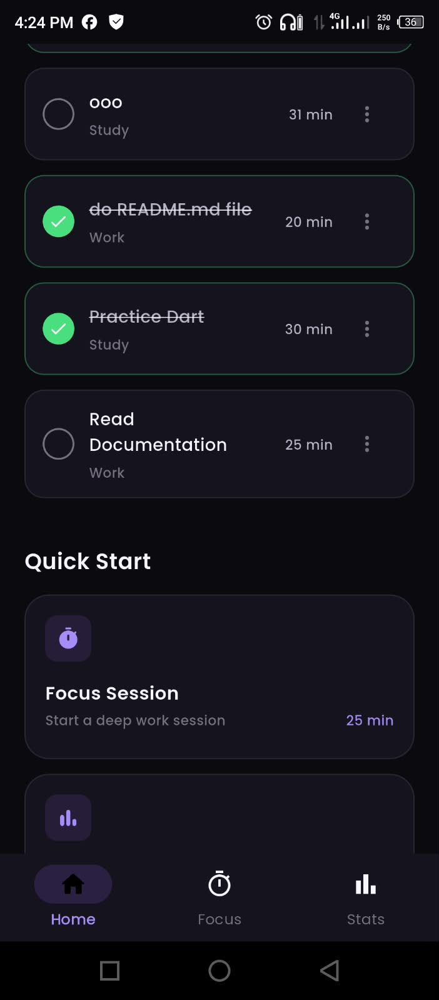 |

---

# 🎨 Design System

FocusFlow uses a consistent dark visual theme throughout the application.

### Primary Colors

| Color     | Purpose                |
| --------- | ---------------------- |
| `#0B0A10` | Application background |
| `#15131D` | Surface                |
| `#211E2B` | Light surface          |
| `#8B5CF6` | Primary                |
| `#A78BFA` | Primary light          |
| `#F7F5FF` | Primary text           |
| `#B8B3C7` | Secondary text         |
| `#777183` | Muted text             |
| `#4ADE80` | Success                |
| `#FBBF24` | Warning                |
| `#F87171` | Error                  |

### Typography

FocusFlow uses **Poppins** throughout the application for a consistent and modern appearance.

---

# 📱 Responsive Design

Responsiveness is an important part of the FocusFlow application.

The UI is designed to adapt to different screen sizes using Flutter's responsive layout capabilities.

The application avoids unnecessary fixed-width layouts and uses widgets such as:

* `LayoutBuilder`
* `Expanded`
* `Flexible`
* `ConstrainedBox`
* `SingleChildScrollView`
* `FittedBox`

The application was designed with different device sizes in mind, including:

* Small phones
* Standard phones
* Large phones
* Landscape orientation
* Tablets

Example target screen sizes:

```text
320 × 568
360 × 800
390 × 844
430 × 932
844 × 390
800 × 1280
```

The goal is to prevent:

* RenderFlex overflow
* Unbounded height errors
* Content clipping
* Text overflow
* Layout problems on smaller screens

---

# 🧩 Reusable Components

FocusFlow uses reusable widgets to keep the code organized and maintainable.

Examples include:

* `TaskCard`
* `QuickStartCard`
* `FocusProgressCard`
* `ProductivityScoreCard`
* `StatisticCard`
* `WeeklyChart`
* `AchievementCard`
* `EmptyTasksState`
* `AppPageRoute`

These components help maintain consistency throughout the application.

---

# 🗂️ Project Structure

```text
focus_flow/
│
├── android/
├── ios/
│
├── assets/
│   ├── images/
│   ├── icons/
│   └── screenshots/
│
├── lib/
│   ├── main.dart
│   │
│   ├── models/
│   │   └── task.dart
│   │
│   ├── screens/
│   │    ├── add_task_screen.dart
│   │    ├── focus_screen.dart
│   │    ├── home_screen.dart
│   │    ├── main_screen.dart
│   │    └── statistics_screen.dart
│   │
│   ├── services/
│   │   └── task_storage_service.dart
│   │
│   ├── theme/
│   │   ├── app_colors.dart
│   │   ├── app_radius.dart
│   │   ├── app_spacing.dart
│   │   ├── app_text_styles.dart
│   │   └── app_theme.dart
│   │
│   └── widgets/
│       ├── achievement_card.dart
│       ├── app_page_route.dart
│       ├── app_section_header.dart
│       ├── bottom_nav_bar.dart
│       ├── empty_state.dart
│       ├── focus_progress_card.dart
│       ├── focus_timer.dart
│       ├── focusflow_logo.dart
│       ├── productivity_score_card.dart
│       ├── quick_start_card.dart
│       ├── responsive_layout.dart
│       ├── session_task_card.dart
│       ├── statistic_card.dart
│       ├── task_card.dart
│       └── weekly_chart.dart
│
│
├── .gitignore
├── pubspec.yaml
├── pubspec.lock
└── README.md
```

---

# 🛠️ Technologies

* **Flutter** — UI framework
* **Dart** — Programming language
* **Material Design** — UI components
* **Google Fonts** — Typography
* **Hive** — Local task persistence
* **Git** — Version control
* **GitHub** — Source code hosting

---

# 🚀 Getting Started

## Prerequisites

Make sure Flutter is installed and configured on your computer.

Check the Flutter installation using:

```bash
flutter doctor
```

---

## Clone the Repository

```bash
git clone <your-github-repository-url>
```

Navigate into the project:

```bash
cd focus_flow
```

Install dependencies:

```bash
flutter pub get
```

Run the application:

```bash
flutter run
```

---

# 🔍 Code Quality

Before submitting the project, run:

```bash
flutter analyze
```

Run the tests:

```bash
flutter test
```

Build the Android release version:

```bash
flutter build apk --release
```

The generated APK can be found at:

```text
build/app/outputs/flutter-apk/app-release.apk
```

---

# 📋 Assignment Coverage

## Task 1

| Requirement                | Implementation |
| -------------------------- | -------------- |
| Flutter application        |      ✅       |
| Static UI screens          |      ✅       |
| Multiple screens           |      ✅       |
| Responsive UI              |      ✅       |
| Proper spacing and styling |      ✅       |
| Reusable widgets           |      ✅       |
| Assets organization        |      ✅       |
| Consistent design          |      ✅       |

## Task 2

| Requirement                  | Implementation |
| ---------------------------- | -------------- |
| At least 3 connected screens | ✅              |
| Screen navigation            | ✅              |
| Multi-field form             | ✅              |
| Form validation              | ✅              |
| Reusable widgets             | ✅              |
| Consistent colors            | ✅              |
| Consistent typography        | ✅              |
| Responsive mobile UI         | ✅              |
| Local task persistence       | ✅              |
| Organized project structure  | ✅              |

---

# 🔄 Task 1 → Task 2 Evolution

FocusFlow was developed progressively.

### Task 1

The first version concentrated primarily on:

```text
UI Design
   ↓
Static Screens
   ↓
Responsive Layout
   ↓
Reusable Components
```

### Task 2

The application was then extended with:

```text
Static UI
   ↓
Navigation
   ↓
Forms
   ↓
Validation
   ↓
Task Creation
   ↓
Local Persistence
   ↓
Dynamic Statistics
```

This allowed the same FocusFlow concept to evolve from a static UI demonstration into a more functional Flutter application.

---

# 🎯 Learning Outcomes

Through the development of FocusFlow, the project demonstrates practical experience with:

* Flutter widget development
* Dart programming
* Responsive UI design
* Material Design
* Form handling
* Form validation
* Navigation
* Stateful widgets
* Local data persistence
* Reusable components
* UI consistency
* Project organization
* Git and GitHub workflow

---

# 📌 Project Scope

FocusFlow is an educational and internship assignment project.

The project intentionally does not include:

* User authentication
* Cloud database
* External APIs
* Backend services
* Online synchronization
* Complex authentication systems

The focus is on Flutter UI development, navigation, forms, validation, local functionality, responsiveness, and code organization.

---

# 👨‍💻 Author

**Md. Masfiqun Ahmed**

Flutter & Software Development Learner

---

# 📄 License

This project was developed for educational and internship purposes.
