# FocusFlow

> **Plan your work. Focus on what matters.**

A responsive Flutter productivity and focus-management application developed as part of the **Inovegen Internship Program 2026**.

FocusFlow started as a static UI implementation for Task 1 and was progressively developed into a complete local productivity application through Task 2 and Task 3.

The final application allows users to:

- Create and manage tasks
- Edit task information
- View detailed task information
- Mark tasks as completed
- Delete and restore tasks using Undo
- Start task-based focus sessions
- Run Quick Focus sessions
- Pause, resume, reset, and skip focus sessions
- Automatically complete tasks after successful focus sessions
- Persist tasks and focus-session history locally
- View productivity statistics
- Track focus time and completed sessions
- View weekly productivity information
- Monitor an overall productivity score
- Use the application across different screen sizes

---

# 📌 Project Evolution

FocusFlow was developed in three progressive stages.

```text
Task 1
Static UI Screens
       ↓
Task 2
Navigation + Forms + Validation + Task Persistence
       ↓
Task 3
Complete Productivity Application
```

Each task extended the previous implementation while maintaining the same visual identity and application concept.

---

# 📌 Task 1 — Static UI Screens

## Overview

**Task 1: Flutter Mobile App Development — Static UI Screens**

The first stage of FocusFlow focused on designing and implementing a small Flutter application with multiple static UI screens.

The primary goals were:

- Flutter UI development
- Widget composition
- Layout and spacing
- Typography and styling
- Responsive design
- Reusable components
- Consistent visual design

No authentication, API, database, or backend functionality was required for Task 1.

---

## Concept

FocusFlow was initially designed as a productivity-focused mobile interface that helps users organize their work, start focused work sessions, and monitor productivity.

The application uses a dark interface with purple accents to create a modern productivity-oriented visual experience.

---

## Task 1 Screens

The initial version included:

- Home
- Focus Session
- Statistics

---

## 🖼️ Task 1 Screenshots


| Home Screen                                          | Focus Session                                         | Statistics Screen                                      | Statistics Extra                                       |
| ---------------------------------------------------- | ----------------------------------------------------- | ------------------------------------------------------ | ------------------------------------------------------ |
| 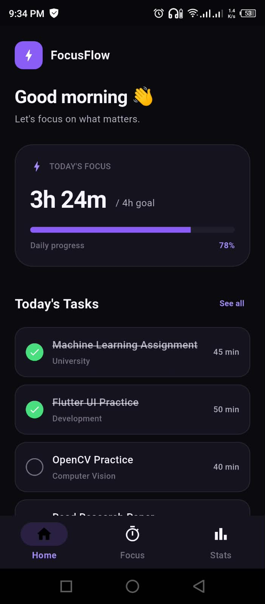 | 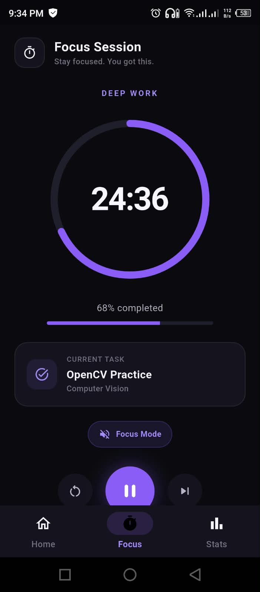 | 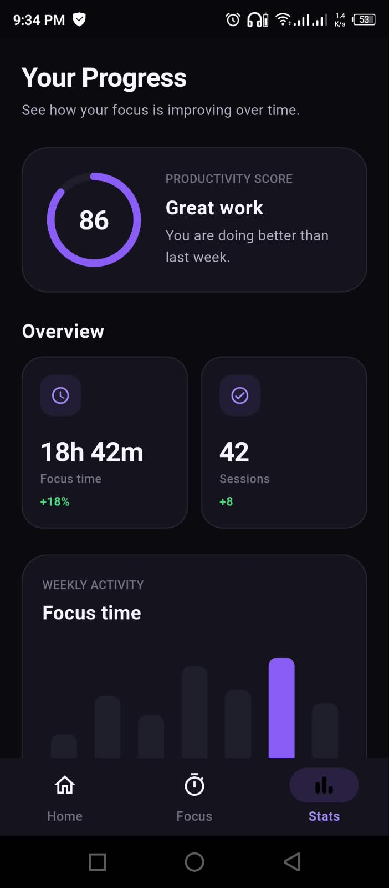 | 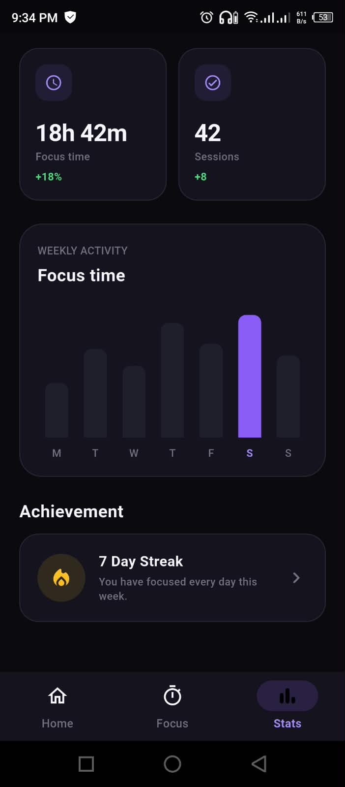 |

---

## Task 1 Technologies

- Flutter
- Dart
- Material Design
- Google Fonts

---

## Task 1 Features

- Responsive UI
- Reusable components
- Productivity dashboard
- Focus session interface
- Statistics visualization
- Consistent dark theme
- Modern typography
- Responsive layouts

---

# 📌 Task 2 — Multi-Screen App, Navigation & Forms

## Overview

**Task 2: Flutter Mobile App Development — Multi-Screen App, Navigation & Forms**

Task 2 transformed the static FocusFlow interface into an interactive multi-screen Flutter application.

The main goals were:

- Multiple connected screens
- Screen-to-screen navigation
- Form handling
- Form validation
- Task creation
- Local task persistence
- Reusable widgets
- Responsive layouts
- Consistent application styling

The application does not use authentication, external APIs, or a backend service.

---

# 🏠 Task 2 — Home Screen

The Home screen acts as the main productivity dashboard.

It provides:

- Productivity overview
- Today's focus progress
- Task list
- Quick-start focus options
- Task completion
- Task deletion
- Navigation to other features

Users can navigate to:

- Add Task
- Focus Session
- Statistics

---

# ➕ Task 2 — Add Task Screen

The Add Task screen allows users to create productivity tasks.

The form contains:

- Task Title
- Description
- Category
- Focus Duration

Available categories:

- Study
- Work
- Personal
- Health
- Other

The form uses Flutter's `Form` and `GlobalKey<FormState>` for validation.

---

# 🎯 Task 2 — Focus Session Screen

The Focus Session screen provides a dedicated countdown interface for focused work.

Users can select or start a focus session and work for a defined duration.

---

# 📊 Task 2 — Statistics Screen

The Statistics screen displays productivity information derived from the application's data.

It includes information such as:

- Total tasks
- Completed tasks
- Focus time
- Completion percentage
- Productivity score
- Session trends
- Productivity insights

---

# 🧭 Task 2 Application Flow

```text
                     ┌──────────────┐
                     │     Home     │
                     └──────┬───────┘
                            │
           ┌────────────────┼────────────────┐
           │                │                │
           ▼                ▼                ▼
     ┌───────────┐   ┌──────────────┐   ┌────────────┐
     │ Add Task  │   │ Focus Session│   │ Statistics │
     └─────┬─────┘   └──────────────┘   └────────────┘
           │
           ▼
     ┌──────────────┐
     │     Home     │
     │ Updated Task │
     └──────────────┘
```

---

# 📝 Task 2 — Form & Validation

## Task Title

Validation:

- Required
- Minimum 3 characters
- Maximum 60 characters

## Description

Validation:

- Required
- Minimum 5 characters
- Maximum 300 characters

## Category

The user selects one of the available task categories.

## Focus Duration

Validation:

- Required
- Must be a valid number
- Minimum: 1 minute
- Maximum: 180 minutes

Invalid information produces appropriate validation messages.

---

# 💾 Task 2 — Local Task Persistence

Task 2 introduced local task persistence using **Hive**.

Tasks can be:

- Created
- Saved
- Updated
- Marked as completed
- Deleted
- Restored using Undo

This allows task information to remain available while navigating through the application.

# 🖼️ Task 2 Screenshots

## 🏠 Home Screen

| Home                                                        |
| ----------------------------------------------------------- |
| 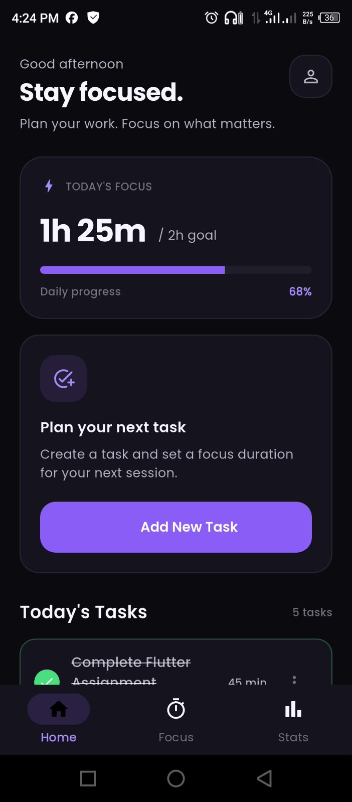 |

---

## ➕ Add Task

| Add Task — Overview                                                |                                                    |
| ----------------------------------------------------------------- | ----------------------------------------------------------------- |
| 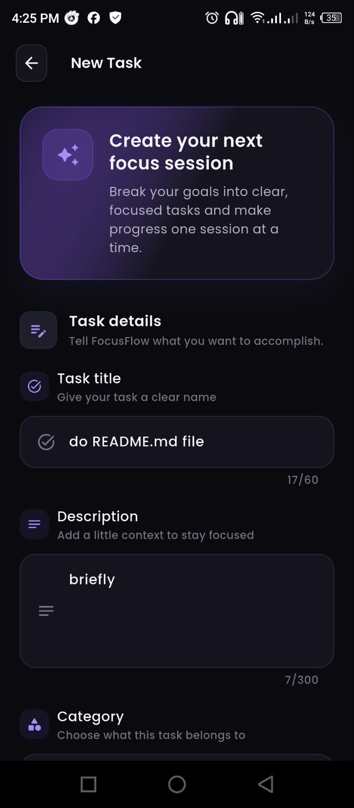 | 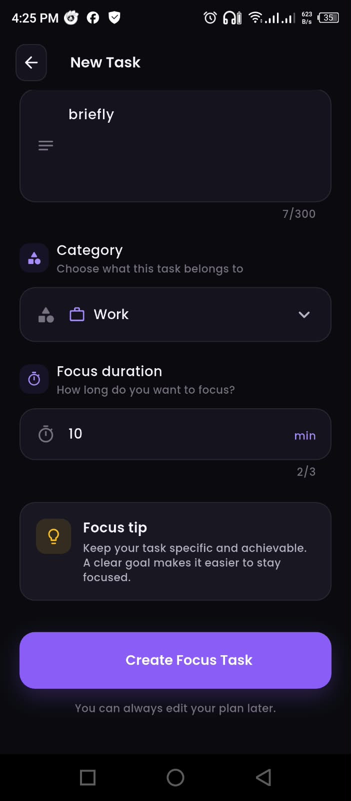 |

---

## ⚠️ Form Validation

| Form Validation                                                        |
| ---------------------------------------------------------------------- |
| 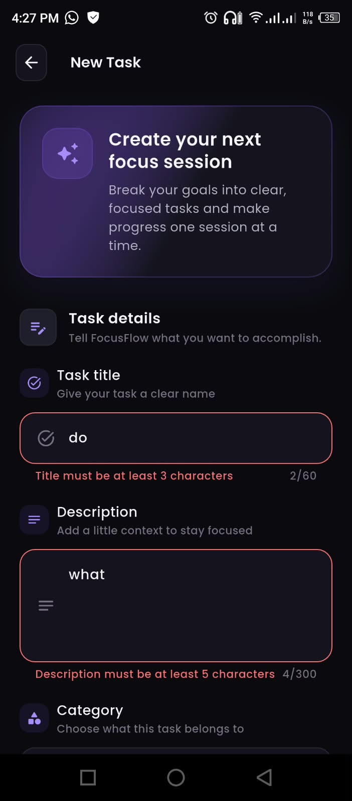 |

---

## 🎯 Focus Session

| Focus Session                                                |
| ------------------------------------------------------------ |
| 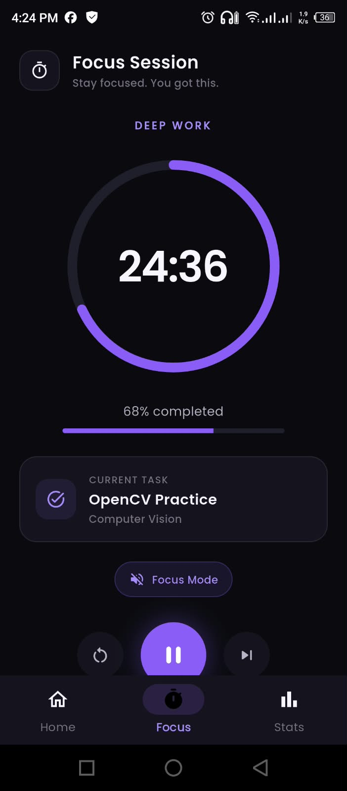 |

---

## 📊 Statistics

| Statistics — Overview                                         |                                           |
| ------------------------------------------------------------- | ------------------------------------------------------------- |
| 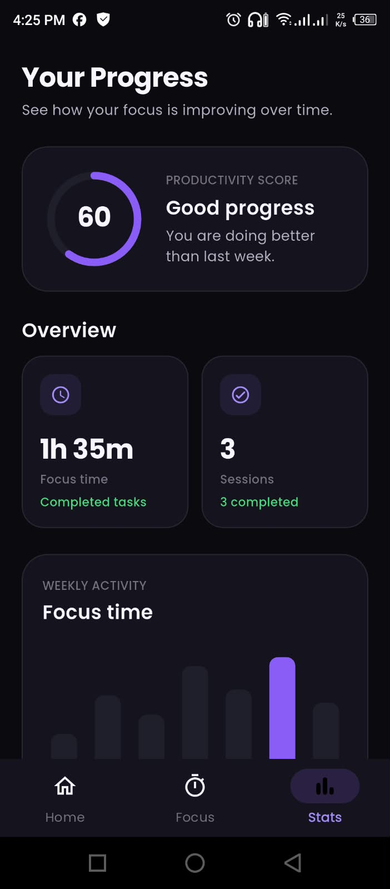 | 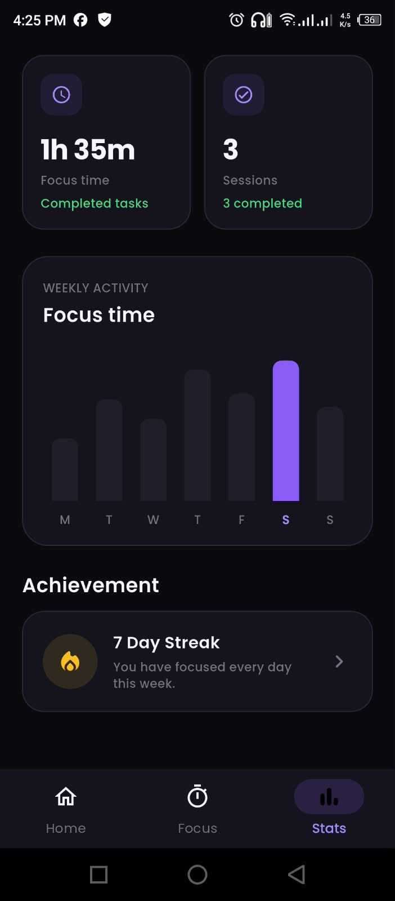 |

---

## ✅ Completed Task

| Completed Task                                                        |
| --------------------------------------------------------------------- |
| 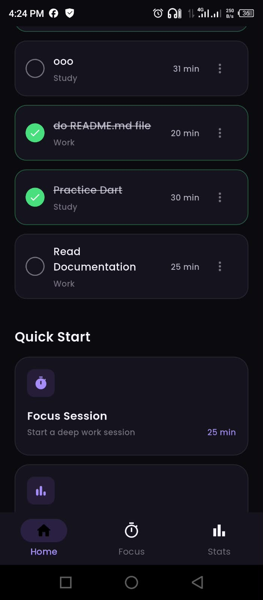 |

---

# 📌 Task 3 — Complete Productivity Application

## Overview

**Task 3 represents the major functional extension of FocusFlow.**

While Task 1 concentrated on UI and Task 2 introduced navigation, forms, validation, and basic persistence, Task 3 transformed FocusFlow into a more complete productivity application.

The major goals of Task 3 were:

- Complete task management
- Task editing
- Task details
- Persistent focus sessions
- Task/session synchronization
- Reliable deletion and restoration
- Dynamic productivity statistics
- Focus-session history
- Productivity scoring
- Improved responsive layouts
- Better application architecture
- Persistent application state

---

# 🧩 Task 3 — Complete Task Management

Task management was significantly expanded in Task 3.

Users can now:

- Create tasks
- View tasks
- Open task details
- Edit tasks
- Change task categories
- Change task descriptions
- Change focus duration
- Mark tasks as completed
- Delete tasks
- Undo task deletion

Each task has a unique identifier that allows it to be associated with focus sessions.

---

# 📄 Task Details Screen

A dedicated **Task Details** screen was introduced.

It provides detailed information about an individual task and allows the user to:

- Review task information
- Edit the task
- Start a focus session for the task
- Delete the task

The screen communicates its result back to the previous screen so that the Home screen can update its state correctly.

---

# ✏️ Task 3 — Edit Task

The Edit Task screen extends the task creation form.

Users can modify:

- Title
- Description
- Category
- Focus duration

The original task ID is preserved during editing.

The completion state is also preserved when task information is updated.

This ensures that editing a task does not accidentally create a duplicate task or reset its completion state.

---

# 🗑️ Task 3 — Safe Task Deletion

Task deletion was improved significantly.

When a task is deleted:

1. The task is identified.
2. Associated focus sessions are identified.
3. The related sessions are backed up.
4. The task's sessions are removed.
5. The task is removed from local storage.
6. The UI is immediately updated.
7. An Undo action is displayed.

If the user selects **Undo**:

```text
Deleted Task
     ↓
Restore Task
     ↓
Restore Associated Sessions
     ↓
Return Task to Original Position
```

This prevents task deletion from leaving unrelated focus-session records behind.

---

# ⏱️ Task 3 — Focus Session Management

The focus system was expanded into a persistent session-management system.

A focus session contains information such as:

- Session ID
- Associated task ID
- Task title
- Planned duration
- Completed duration
- Start time
- Completion time

Focus sessions can therefore be stored and analyzed later.

---

# 🎯 Task 3 — Task-Based Focus Sessions

Users can start a focus session directly from a selected task.

The session uses the task's configured focus duration.

During a session, users can:

- Start the timer
- Pause the timer
- Resume the timer
- Reset the timer
- Skip the session
- Complete the session

When a task-based focus session is successfully completed, the associated task can automatically be marked as completed.

---

# ⚡ Quick Focus

FocusFlow also provides a **Quick Focus** mode.

Quick Focus allows users to start a focus session without first selecting a specific task.

These sessions are stored separately from task-specific sessions.

This distinction allows general focus activity to remain available without requiring every session to belong to a task.

---

# 💾 Task 3 — Persistent Focus Sessions

Focus-session data is stored locally using Hive.

The application maintains a dedicated focus-session storage service.

The stored session data includes:

```text
FocusSession
│
├── id
├── taskId
├── taskTitle
├── durationSeconds
├── completedSeconds
├── startedAt
└── completedAt
```

This means focus-session history remains available even after navigating between screens or restarting the application.

---

# 🔄 Task & Focus Session Synchronization

Task and focus-session data are synchronized throughout the application.

For example:

```text
Task
 │
 ├── Focus Session
 │
 ├── Focus Session
 │
 └── Focus Session
```

If the task is deleted, its associated sessions are also removed.

If the task is restored through Undo, its previously associated sessions are restored as well.

Quick Focus sessions, which do not belong to a task, remain independent.

This prevents orphaned session records and keeps the local data consistent.

---

# 📊 Task 3 — Dynamic Statistics

The Statistics screen was upgraded from a static interface into a dynamic productivity dashboard.

Statistics are calculated from the stored task and focus-session data.

The screen can display:

- Total tasks
- Completed tasks
- Task completion percentage
- Total focus time
- Today's focus time
- Completed focus sessions
- Longest focus session
- Productivity score
- Productivity breakdown
- Weekly focus information
- Recent focus sessions
- Achievement information

---

# 🧮 Productivity Score

FocusFlow calculates a productivity score using multiple aspects of the user's activity.

The score combines:

```text
Task Completion
       +
Focus Time
       +
Completed Focus Sessions
       ↓
Productivity Score
```

The statistics interface also provides a breakdown so that the score is more informative than displaying a single number.

The Productivity Score is calculated from three components:

```text
Productivity Score = (Task Score × 0.40) + (Focus Score × 0.40) + (Session Score × 0.20)
```

### Components

- **Task Score (40%)**
  `Completed Tasks / Total Tasks × 100`

- **Focus Score (40%)**
  `min(Today's Focus Minutes / 125 × 100, 100)`

- **Session Score (20%)**
  `Completed Sessions / Total Sessions × 100`

### Example

```text
Task Score    = 70
Focus Score   = 80
Session Score = 75

Productivity Score = (70 × 0.40) + (80 × 0.40) + (75 × 0.20)
                   = 75/100
```

> This is a custom FocusFlow metric, not a standardized productivity measure.


---

# 📅 Today's Productivity

The Home screen displays today's focus progress.

The application calculates the amount of focus time recorded for the current day and compares it against the daily focus target.

The progress is based on actual stored focus-session data rather than a hard-coded visual value.

---

# 📈 Weekly Productivity

The Statistics screen includes a weekly productivity visualization.

The chart is generated from stored focus-session data and provides a visual representation of focus activity across the week.

---

# 🕒 Recent Session History

The Statistics screen also provides recent focus-session information.

Each session can provide information such as:

- Task/session title
- Duration
- Completed duration
- Session status
- Session date/time

This makes the statistics screen useful not only for scores but also for reviewing previous productivity activity.

---

# 🏆 Achievements

FocusFlow includes an achievement section based on the user's productivity activity.

Achievements can use information such as:

- Completed tasks
- Focus sessions
- Focus duration
- Productivity progress

This adds a motivational layer to the productivity dashboard.

---

# 📱 Responsive Design

Responsiveness remained an important requirement throughout all three tasks.

The final application is designed to adapt to:

- Small phones
- Standard phones
- Large phones
- Landscape orientation
- Tablets
- Wider screens

Example target screen sizes include:

```text
320 × 568
360 × 800
390 × 844
430 × 932
844 × 390
800 × 1280
```

The application uses responsive Flutter widgets and layout techniques including:

- `LayoutBuilder`
- `Expanded`
- `Flexible`
- `ConstrainedBox`
- `SingleChildScrollView`
- `FittedBox`

Different layouts and spacing are used depending on available screen width.

The implementation is designed to reduce common problems such as:

- RenderFlex overflow
- Text overflow
- Content clipping
- Unbounded layout errors
- Fixed-width layout problems

---

# 🎨 Design System

FocusFlow maintains a consistent dark visual identity throughout the application.

## Primary Colors

| Color | Purpose |
|---|---|
| `#0B0A10` | Application background |
| `#15131D` | Surface |
| `#211E2B` | Light surface |
| `#8B5CF6` | Primary |
| `#A78BFA` | Primary light |
| `#F7F5FF` | Primary text |
| `#B8B3C7` | Secondary text |
| `#777183` | Muted text |
| `#4ADE80` | Success |
| `#FBBF24` | Warning |
| `#F87171` | Error |

## Typography

FocusFlow uses **Poppins** throughout the interface.

Typography is centralized through reusable text styles to maintain consistency across screens.

---

# 🧩 Reusable Components

The application uses reusable widgets to keep the interface consistent and maintainable.

Examples include:

- `TaskCard`
- `QuickStartCard`
- `FocusProgressCard`
- `FocusTimer`
- `FocusModeChip`
- `SessionTaskCard`
- `StatisticCard`
- `WeeklyChart`
- `ProductivityScoreCard`
- `ProductivityBreakdown`
- `AchievementCard`
- `SessionHistoryCard`
- `ResponsiveLayout`
- `AppPageRoute`

Reusable components reduce duplicated UI code and allow the visual design to remain consistent across screens.

---

# 🗂️ Final Project Structure

```text
focus_flow/
│
├── android/
├── ios/
├── web/
├── linux/
├── macos/
├── windows/
│
├── assets/
│   └── screenshots/
│       ├── home.jpeg
│       ├── focus.jpeg
│       ├── stat-1.jpeg
│       ├── stat-2.jpeg
│       └── Task-2/
│
├── lib/
│   │
│   ├── main.dart
│   │
│   ├── models/
│   │   ├── task.dart
│   │   └── focus_session.dart
│   │
│   ├── screens/
│   │   ├── home_screen.dart
│   │   ├── add_task_screen.dart
│   │   ├── edit_task_screen.dart
│   │   ├── task_details_screen.dart
│   │   ├── focus_screen.dart
│   │   ├── main_screen.dart
│   │   ├── task_details_screen.dart
│   │   └── statistics_screen.dart
│   │
│   ├── services/
│   │   ├── task_storage_service.dart
│   │   └── focus_session_storage_service.dart
│   │
│   ├── theme/
│   │   ├── app_colors.dart
│   │   ├── app_radius.dart
│   │   ├── app_spacing.dart
│   │   ├── focus_theme.dart
│   │   └── app_text_styles.dart
│   │
│   └── widgets/
│       ├── achievement_card.dart
│       ├── app_page_route.dart
│       ├── app_section_header.dart
│       ├── bottom_nav_bar.dart
│       ├── empty_state.dart
│       ├── focus_mode_chip.dart
│       ├── focus_progress_card.dart
│       ├── focus_timer.dart
│       ├── productivity_breakdown.dart
│       ├── productivity_score_card.dart
│       ├── quick_start_card.dart
│       ├── responsive_layout.dart
│       ├── session_history_card.dart
│       ├── session_task_card.dart
│       ├── statistic_card.dart
│       ├── task_card.dart
│       └── weekly_chart.dart
│
├── test/
│
├── .gitignore
├── analysis_options.yaml
├── pubspec.yaml
├── pubspec.lock
└── README.md
```

> The structure above represents the final application architecture. Additional generated/platform files may exist depending on the Flutter environment.

---

# 🛠️ Technologies

| Technology | Purpose |
|---|---|
| **Flutter** | Cross-platform application framework |
| **Dart** | Programming language |
| **Material Design** | UI components and design system |
| **Google Fonts** | Poppins typography |
| **Hive** | Local data persistence |
| **FL Chart** | Productivity charts and visualization |
| **Git** | Version control |
| **GitHub** | Source-code hosting |

---

# 💾 Data Architecture

FocusFlow uses two primary local data models.

## Task

```text
Task
│
├── id
├── title
├── description
├── category
├── duration
└── isCompleted
```

## FocusSession

```text
FocusSession
│
├── id
├── taskId
├── taskTitle
├── durationSeconds
├── completedSeconds
├── startedAt
└── completedAt
```

The two models are connected through `taskId`.

```text
                 ┌──────────────┐
                 │     Task     │
                 │              │
                 │      ID      │
                 └───────┬──────┘
                         │
                 taskId relationship
                         │
            ┌────────────┼────────────┐
            │            │            │
            ▼            ▼            ▼
       FocusSession  FocusSession  FocusSession
```

---

# 🔄 Final Application Flow

```text
                         ┌──────────────┐
                         │     Home     │
                         └──────┬───────┘
                                │
              ┌─────────────────┼──────────────────┐
              │                 │                  │
              ▼                 ▼                  ▼
        ┌───────────┐    ┌──────────────┐    ┌────────────┐
        │ Add Task  │    │ Focus Session│    │ Statistics │
        └─────┬─────┘    └──────────────┘    └────────────┘
              │
              ▼
        ┌───────────────┐
        │     Home      │
        │ Updated Task  │
        └───────┬───────┘
                │
                ▼
        ┌────────────────┐
        │ Task Details   │
        └───────┬────────┘
                │
        ┌───────┴─────────┐
        │                 │
        ▼                 ▼
   Edit Task        Focus Session
        │                 │
        ▼                 ▼
   Updated Task      Save Session
                          │
                          ▼
                    Update Statistics
```

---

# 🔐 Project Scope

FocusFlow intentionally remains a local application.

The project does **not** use:

- User authentication
- Cloud database
- External APIs
- Backend services
- Online synchronization
- Remote user accounts

All productivity information is stored locally on the device.

This keeps the project focused on Flutter development, application architecture, responsive UI, local persistence, navigation, forms, timers, and productivity analytics.

---

# 📋 Assignment Coverage

## Task 1

| Requirement | Implementation |
|---|---|
| Flutter application | ✅ |
| Static UI screens | ✅ |
| Multiple screens | ✅ |
| Responsive UI | ✅ |
| Proper spacing and styling | ✅ |
| Reusable widgets | ✅ |
| Assets organization | ✅ |
| Consistent design | ✅ |

## Task 2

| Requirement | Implementation |
|---|---|
| At least 3 connected screens | ✅ |
| Screen navigation | ✅ |
| Multi-field form | ✅ |
| Form validation | ✅ |
| Task creation | ✅ |
| Local task persistence | ✅ |
| Reusable widgets | ✅ |
| Consistent colors | ✅ |
| Consistent typography | ✅ |
| Responsive mobile UI | ✅ |
| Organized project structure | ✅ |

## Task 3

| Requirement | Implementation |
|---|---|
| Complete task management | ✅ |
| Task details screen | ✅ |
| Task editing | ✅ |
| Task completion | ✅ |
| Task deletion | ✅ |
| Undo task deletion | ✅ |
| Focus session management | ✅ |
| Task-based focus sessions | ✅ |
| Quick Focus | ✅ |
| Pause / Resume | ✅ |
| Reset / Skip | ✅ |
| Persistent focus sessions | ✅ |
| Task/session synchronization | ✅ |
| Session history | ✅ |
| Dynamic statistics | ✅ |
| Productivity score | ✅ |
| Productivity breakdown | ✅ |
| Weekly productivity chart | ✅ |
| Achievement information | ✅ |
| Responsive layouts | ✅ |
| Local persistence | ✅ |
| Error-safe storage handling | ✅ |

---

# 🔄 Task 1 → Task 2 → Task 3 Evolution

## Task 1

```text
UI Design
    ↓
Static Screens
    ↓
Responsive Layout
    ↓
Reusable Components
```

## Task 2

```text
Static UI
    ↓
Navigation
    ↓
Forms
    ↓
Validation
    ↓
Task Creation
    ↓
Local Task Persistence
```

## Task 3

```text
Task Management
       ↓
Task Details
       ↓
Task Editing
       ↓
Focus Sessions
       ↓
Session Persistence
       ↓
Task/Session Synchronization
       ↓
Deletion + Undo
       ↓
Dynamic Statistics
       ↓
Productivity Analytics
       ↓
Complete FocusFlow Application
```

This progression demonstrates how the same application concept evolved across the internship tasks rather than creating unrelated projects for each stage.

---

# 🎯 Learning Outcomes

Through the development of FocusFlow, the project demonstrates practical experience with:

- Flutter widget development
- Dart programming
- Responsive UI design
- Material Design
- Form handling
- Form validation
- Navigation
- Stateful widgets
- Local data persistence
- Data modeling
- Service-layer architecture
- Reusable components
- Timer-based application logic
- Session management
- CRUD operations
- Data synchronization
- Undo/restore workflows
- Dynamic statistics
- Data visualization
- UI consistency
- Responsive application architecture
- Git and GitHub workflow
- Debugging and iterative development

---

# 🚀 Getting Started

## Prerequisites

Make sure Flutter is installed and configured.

Check the Flutter environment with:

```bash
flutter doctor
```

## Clone the Repository

```bash
git clone <https://github.com/Masfiqun/Focus-Flow.git>
```

Navigate into the project:

```bash
cd focus_flow
```

Install dependencies:

```bash
flutter pub get
```

Run the application:

```bash
flutter run
```

---

# 🔍 Code Quality

Before submitting the project, run:

```bash
flutter clean
```

```bash
flutter pub get
```

```bash
flutter analyze
```

Run tests:

```bash
flutter test
```

Build the Android release version:

```bash
flutter build apk --release
```

The generated APK can be found at:

```text
build/app/outputs/flutter-apk/app-release.apk
```

---

# 🧪 Final Testing Checklist

## Task Management

- [x] Create task
- [x] Edit task
- [x] View task details
- [x] Complete task
- [x] Delete task
- [x] Undo deletion
- [x] Task remains after navigation
- [x] Task remains after application restart

## Focus Sessions

- [x] Start task focus session
- [x] Start Quick Focus
- [x] Pause session
- [x] Resume session
- [x] Reset session
- [x] Skip session
- [x] Complete session
- [x] Save session locally
- [x] Display session in statistics
- [x] Update task after completed focus session

## Statistics

- [x] Total task count
- [x] Completed task count
- [x] Completion percentage
- [x] Total focus time
- [x] Today's focus time
- [x] Completed sessions
- [x] Productivity score
- [x] Productivity breakdown
- [x] Weekly chart
- [x] Recent session history
- [x] Achievement information

## Responsive UI

- [x] Small phone
- [x] Standard phone
- [x] Large phone
- [x] Landscape
- [x] Tablet

---

# 🖼️ Final Screenshot Collection

| Home Screen                                          |                                          | Focus Screen                                      | Statistics Screen                                       |
| ---------------------------------------------------- | ----------------------------------------------------- | ------------------------------------------------------ | ------------------------------------------------------ |
| 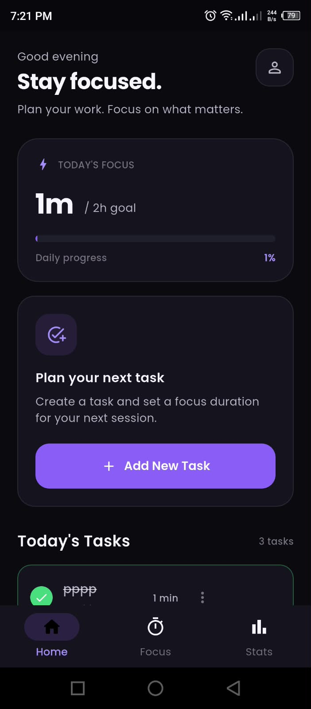 | 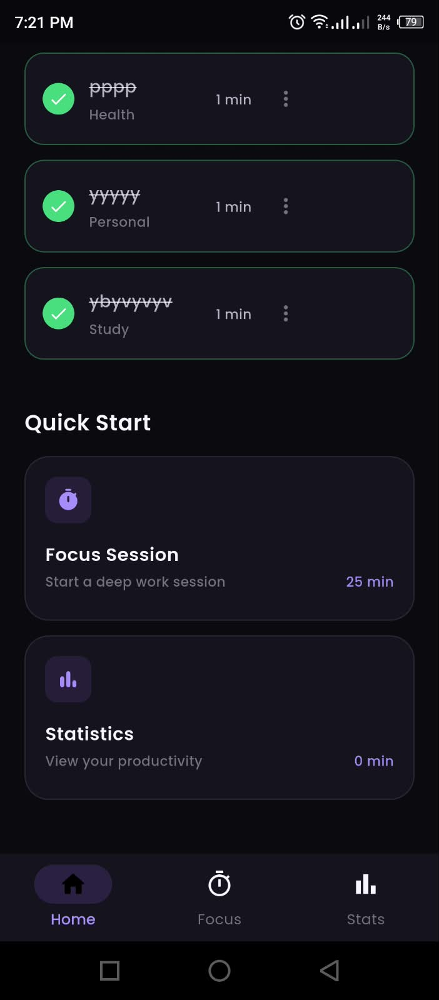 | 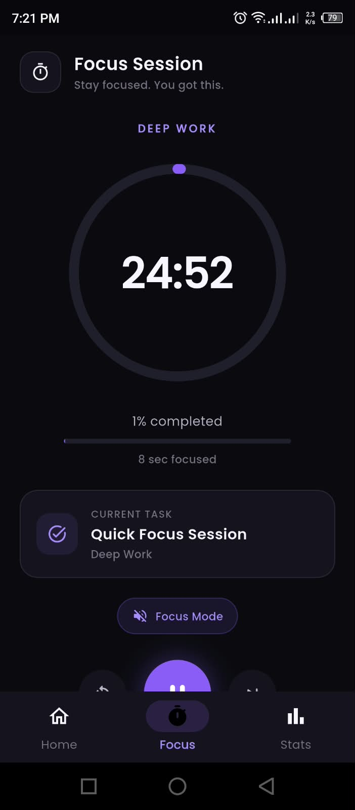 | 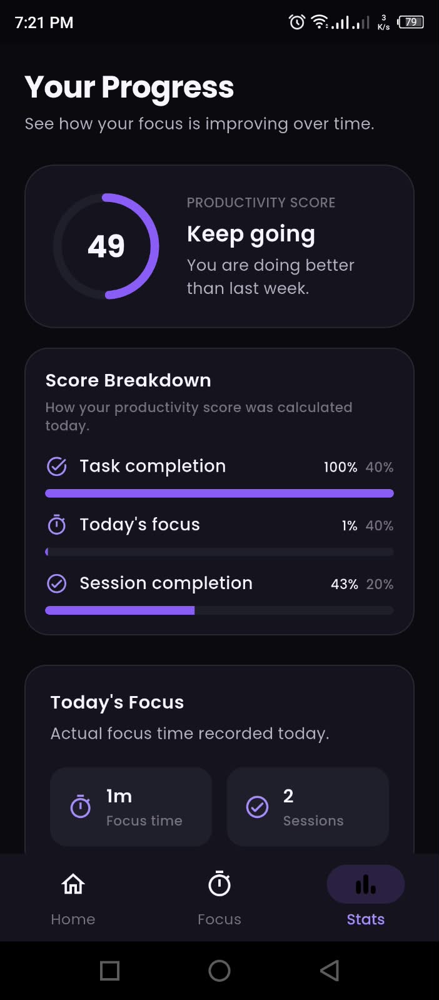 |

---

| Statistics Screen                                          |                                          | New Task                                      |                                        |
| ---------------------------------------------------- | ----------------------------------------------------- | ------------------------------------------------------ | ------------------------------------------------------ |
| 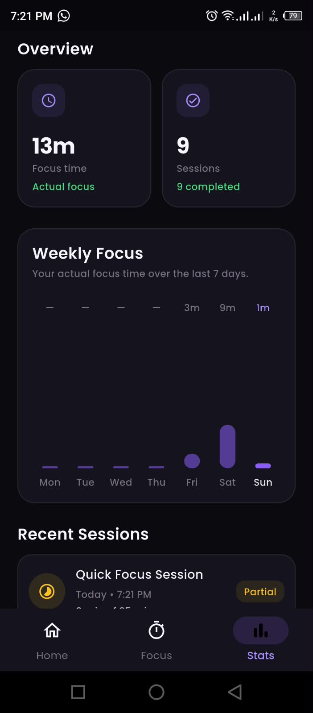 | 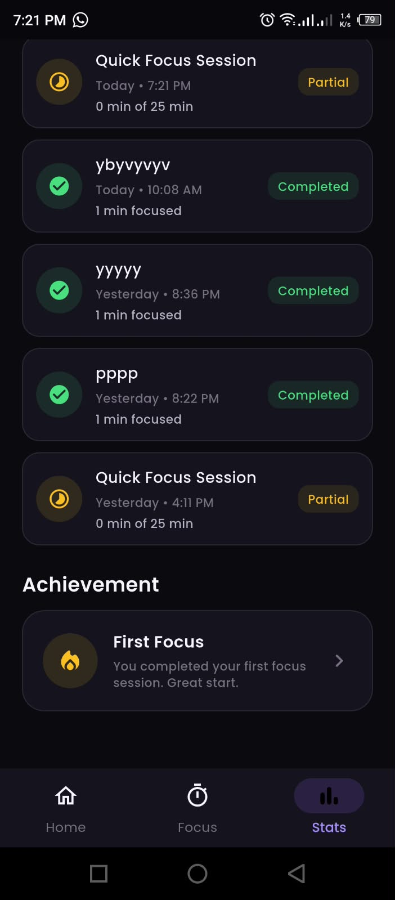 | 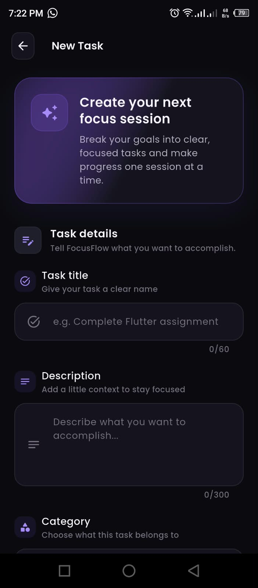 | 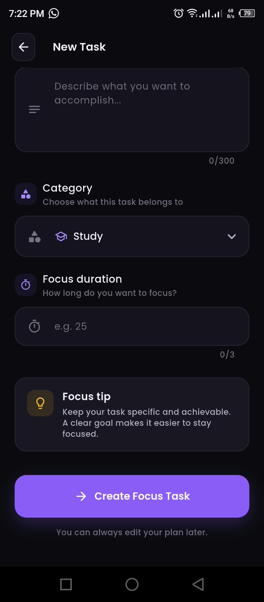 |

---

| Task Details                                          | Update Task                                         | 
| ---------------------------------------------------- | ----------------------------------------------------- | 
| 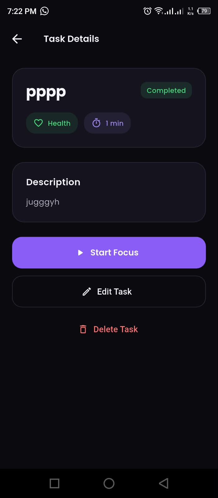 | 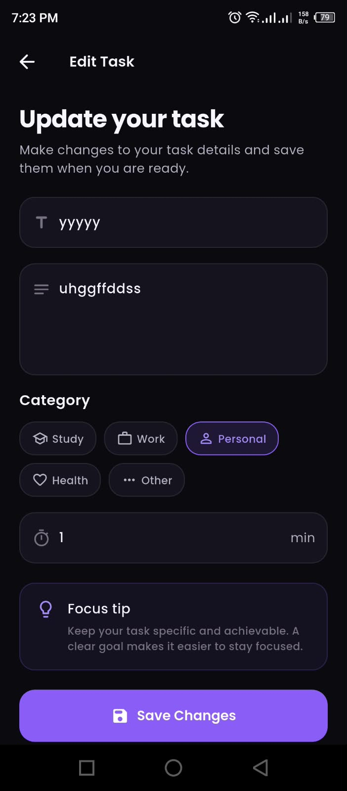 | 

---

# 📌 Final Project Status

**FocusFlow Task 3 — Completed ✅**

The application has progressed from a static UI prototype into a functional local productivity application.

### Final capabilities

```text
              ┌─────────────────────┐
              │      FocusFlow      │
              └──────────┬──────────┘
                         │
        ┌────────────────┼────────────────┐
        │                │                │
        ▼                ▼                ▼
   Task Management   Focus Sessions   Statistics
        │                │                │
        ▼                ▼                ▼
   Create/Edit       Start/Pause      Productivity
   Complete/Delete   Resume/Reset       Score
   Undo/Restore      Skip/Complete      Charts
        │                │                │
        └────────────────┼────────────────┘
                         ▼
                 Local Persistence
                         │
                         ▼
                   Hive Storage
```

The final application demonstrates a complete Flutter development workflow covering UI design, responsive layouts, navigation, forms, validation, local storage, application state, timer logic, data synchronization, analytics, and reusable architecture.

---

# 👨‍💻 Author

**Md. Masfiqun Ahmed**

Flutter & Software Development Learner

---

# 📄 License

This project was developed for **educational and internship purposes** as part of the **Inovegen Internship Program 2026**.

---

# 🙏 Acknowledgement

FocusFlow was developed progressively throughout the internship tasks, with each stage building upon the previous implementation.

The project began as a static UI exercise and evolved into a functional productivity application through iterative development, debugging, responsive design improvements, local data persistence, and feature integration.

**FocusFlow — Plan your work. Focus on what matters.**
